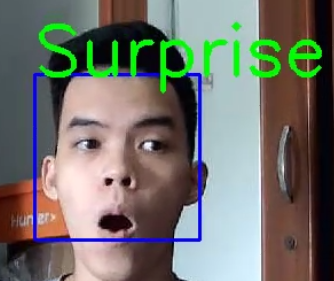

# Facial Expression Recognition 

## Built With
* Python
* Jupyter NoteBook
* Google Colab

## Problem
* Given a set of facial images (48x48 pixel grayscale images of faces (0=Angry, 1=Disgust, 2=Fear, 3=Happy, 4=Sad, 5=Surprise, 6=Neutral)

## Way to go
* Face Detection - Location of face in the scene (image or video)
* Extracting information about facial features from the detected faces.
* Facial Expression and Emotion Classification - Classifying the  obtained information into expression interpretative categories such as smile or frown or emotion categories such as happy, anger, disgust etc.

## Approach
### Data Preprocessing
* Read image, resize it again to 48x48 pixel dimention and convert it to grayscale
### Data Augmentation

* I used variety of data augmentation that is implemented in Keras such as : flip, zoom, rotation to increase model performance

## Algorithms
*  Neutral Network approach with 7 Convolution Layer and 1 Fully Connected layer

## Result

### Model Loss

### Model Accuracy

